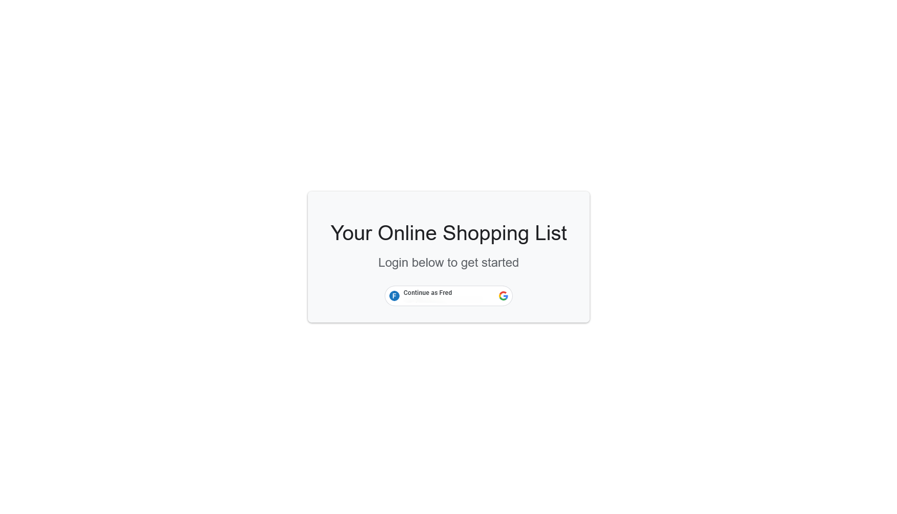
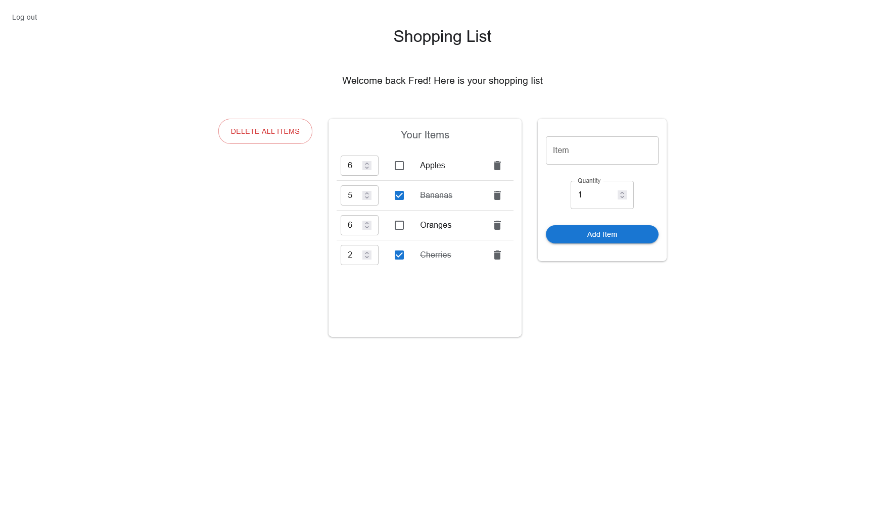

# Your online shopping list

## Overview

This project is a simple webapp that allows users to keep track of their shopping list. It provides a digital alternative to pen and paper, so that you can save your precious notebook space.

## Features

- Add items to your shopping list
- View the whole shopping list
- Tick an item off the list when you go shopping
- Delete an individual item from the shopping list
- Delete the entire shopping list, with a single button click
- Login with your Google account to save your shopping list
- Automatically logs you in when you return to the website
- Log out to use multiple accounts

## Preview




## Installation

Prerequisites

- Python (tested on Python version 3.13.3)
- Node.js (tested on v20.12.1)

#### Backend setup

```bash
# Clone the repository onto your machine
git clone https://github.com/google-london-apprenticeships/Project-FP.git
cd Project-FP/backend

# Set up and activate the virtual environment
python -m venv .venv
.venv\Scripts\activate # If you are on Windows
source .venv/bin/activate # If you are on macOS/Linux

# Install the dependencies
pip install -r requirements.txt

# Run the web server
flask run
```

#### Frontend setup

```bash
cd ../frontend

# Install the dependencies
npm install

# Run the website (in development mode)
npm run dev

```

## Technologies used

- **Frontend:** ReactJS, Material UI, React Router
- **Backend:** Flask, SQLite
- **Authentication:** Google OAuth 2.0
